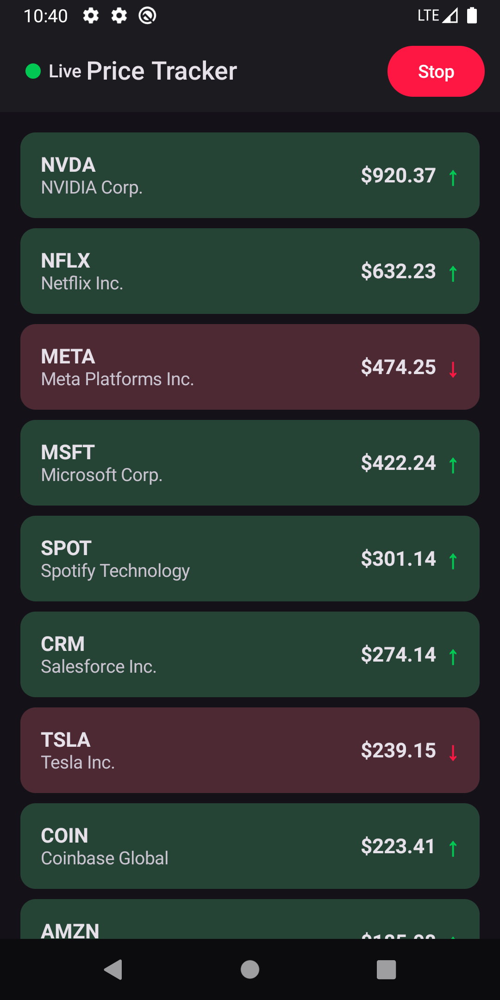
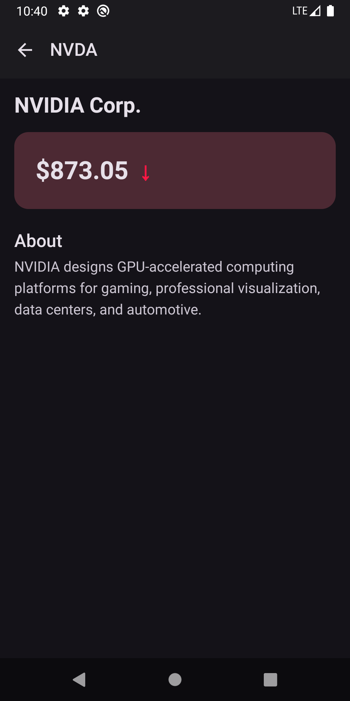
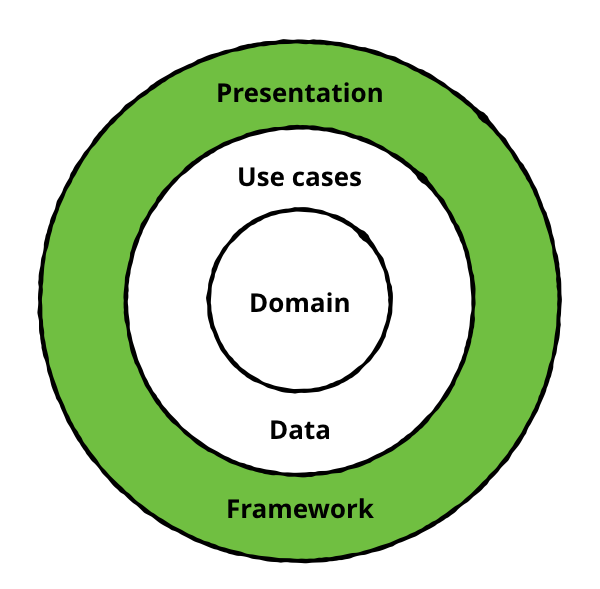

# Real-Time Price Tracker

A real-time stock price tracking Android application built with **Jetpack Compose**, following **Clean Architecture** principles with a multi-module structure. The app connects to a WebSocket echo server to simulate live price updates for 25 stock symbols, featuring a scrollable feed with real-time price indicators and a detailed view for each symbol.

## Screenshots

<p align="center">
  
  &nbsp;&nbsp;&nbsp;&nbsp;
  
</p>

## Features

- **Live Price Feed** — Real-time price updates for 25 stock symbols via WebSocket connection
- **Price Change Indicators** — Visual green/red arrows and flash animations on price changes
- **Sorted Feed** — Stocks automatically sorted by price (highest first)
- **Symbol Details** — Detailed view with company description and live price tracking
- **Connection Status** — Live/Offline/Connecting indicator in the top bar
- **Start/Stop Control** — Toggle button to control the price feed
- **Deep Linking** — Navigate directly to symbol details via `stocks://symbol/{SYMBOL}`
- **Light & Dark Theme** — Full support with Material 3 dynamic colors

## Architecture

The project follows **Clean Architecture** with a strict multi-module structure. Each layer has a single responsibility and dependencies flow inward — the domain layer has zero external dependencies.

<p align="center">
  
</p>

### Module Structure

```
pricetracker/
├── app/                    # Application entry point, Koin DI setup
├── domain/                 # Pure Kotlin — models, repository interfaces, use cases
├── data/                   # WebSocket service, repository implementation, mappers
└── presentation/           # Jetpack Compose UI, ViewModels, MVI state management
```

### Dependency Flow

```
app → presentation, data, domain
presentation → domain
data → domain
```

The **domain** module is a pure Kotlin/JVM library with no Android dependencies, ensuring business logic remains framework-agnostic and easily testable.

### Presentation Layer — Orbit MVI + StateReader Pattern

The presentation layer uses **Orbit MVI** for unidirectional data flow and a custom **StateReader** pattern (`focusOn` / `read`) to achieve granular recomposition control:

```
Screen (collectAsState)
  └── stateReader = { uiState }                // lambda — no read here
      │
      ├── ScreenContent(stateReader)           // receives lambda — no recomposition
      │   │
      │   ├── focusOn { connectionState }       // derives new lambda — no recomposition
      │   │   └── ConnectionIndicator(reader)   // reads only its own fields
      │   │       └── read { label }            // recomposition ONLY here
      │   │
      │   └── StockList(stateReader)
      │       └── read { stocks }               // recomposition ONLY here
      │           └── StockRow({ stock })
      │               ├── read { symbol }
      │               ├── read { formattedPrice }
      │               └── read { priceChange }  // each isolated
```

**Key benefits:**
- **Minimal recomposition** — only composables that `read` a changed value recompose
- **`focusOn`** narrows state for child composables without triggering parent recomposition
- **`read`** uses `derivedStateOf` under the hood — skips recomposition when the selected value hasn't changed
- **No unnecessary work** — parent composables that only pass state down never recompose

### Screen Declaration Pattern

Every screen follows a strict two-part pattern:

| Part | Responsibility |
|---|---|
| `FeedScreen` | Collects Orbit state & effects, wires ViewModel callbacks |
| `FeedScreenContent` (internal) | Pure UI rendering from `stateReader`, fully previewable |

This separation enables easy **Compose Previews** without ViewModel instantiation and keeps MVI concerns isolated from UI rendering.

### Feature Package Structure

```
ui/feed/
├── screen/
│   ├── FeedScreen.kt              # MVI collection, ViewModel wiring
│   └── FeedScreenContent.kt       # Pure composable with stateReader
├── component/
│   ├── ConnectionIndicatorComposable.kt
│   ├── FeedToggleButton.kt
│   ├── StockList.kt
│   ├── StockRowComposable.kt
│   └── PriceChangeIndicatorComposable.kt
└── mvi/
    ├── FeedScreenState.kt         # State + child states + companion INITIAL
    ├── FeedEffect.kt              # Sealed interface, @Immutable
    └── FeedViewModel.kt           # Orbit ContainerHost
```

### State Management

States are plain `data class` with default values and a `companion object { val INITIAL }`. Collections use `ImmutableList<T>` from `kotlinx-collections-immutable` for Compose stability. No separate UI models — the domain model maps directly into the screen state inside the ViewModel.

### Navigation

Type-safe navigation using `@Serializable` route classes with Navigation Compose 2.8+:

```kotlin
@Serializable
data object Feed

@Serializable
data class Detail(val symbol: String)
```

No hardcoded string routes — the compiler enforces type safety for all navigation arguments. Deep links are declared via `navDeepLink<Detail>(basePath = "stocks://symbol")`.

## WebSocket Integration

The app connects to `wss://ws.postman-echo.com/raw` — an echo WebSocket server:

1. Every **2 seconds**, a random price update is generated for each of the 25 symbols
2. The update is **sent** to the echo server as JSON (`{"symbol":"AAPL","price":180.25}`)
3. The server **echoes** the message back
4. The echoed message is **parsed** and the UI state is updated

A single WebSocket connection is shared across both screens — navigating to the detail screen doesn't create a duplicate connection.

## Testing

The project includes comprehensive tests across all layers:

| Layer | Tests | Coverage |
|---|---|---|
| **Domain** | 35 unit tests | Models, use cases, exceptions |
| **Data** | 49 unit tests | Mapper, repository, data provider |
| **Presentation** | 55 UI tests | Components, screen content, interactions |
| **Total** | **139 tests** | |

```bash
# Run domain & data unit tests
./gradlew :domain:test :data:testDebugUnitTest

# Run presentation UI tests (requires emulator/device)
./gradlew :presentation:connectedDebugAndroidTest
```

## Built With

| Library | Purpose |
|---|---|
| [Kotlin](https://kotlinlang.org/) | First-class and official programming language for Android development |
| [Jetpack Compose](https://developer.android.com/jetpack/compose) | Modern declarative UI toolkit for building native Android interfaces |
| [Compose Navigation](https://developer.android.com/jetpack/compose/navigation) | Type-safe navigation framework with `@Serializable` route classes |
| [Orbit MVI](https://orbit-mvi.org/) | Unidirectional data flow framework — state, side effects, and intents |
| [Kotlin Flow](https://kotlinlang.org/docs/flow.html) | Reactive stream API for asynchronous data handling |
| [ViewModel](https://developer.android.com/topic/libraries/architecture/viewmodel) | Lifecycle-aware state holder that survives configuration changes |
| [Material 3](https://m3.material.io/) | Material Design 3 components with dynamic color and theming support |
| [Koin](https://insert-koin.io/) | Lightweight Kotlin dependency injection framework |
| [OkHttp](https://square.github.io/okhttp/) | Efficient HTTP & WebSocket client with connection pooling |
| [Kotlinx Serialization](https://github.com/Kotlin/kotlinx.serialization) | Kotlin-native JSON serialization for WebSocket messages and navigation |
| [Kotlinx Collections Immutable](https://github.com/Kotlin/kotlinx.collections.immutable) | Immutable collection types for Compose stability guarantees |
| [MockK](https://mockk.io/) | Kotlin-first mocking library for unit testing |
| [Turbine](https://github.com/cashapp/turbine) | Testing library for Kotlin Flow — clean and concise flow assertions |
| [JUnit 4](https://junit.org/junit4/) | Standard unit testing framework for JVM-based tests |
| [Compose UI Testing](https://developer.android.com/jetpack/compose/testing) | Instrumented UI tests for verifying Compose component behavior |

## Requirements

- Android Studio Ladybug or newer
- Min SDK 24 (Android 7.0)
- Target SDK 36
- JDK 11+
